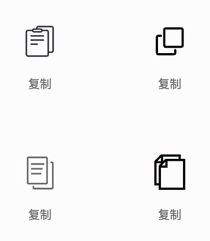
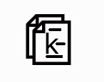

# 使用 canvas 绘制 icon

## 前言

近期在做一款名为 Kopi 的谷歌浏览器复制文本扩展，做完觉得需要一个 icon 来展示，因为 icon 标志性、功能识别性强，让人一看就知道该插件是用来干嘛的，这也符合扩展单一的功能作用。

了解下其他 icon 获取来源和制作方法，例如阿里巴巴图标、icon 生成网站固定模版生成、PS 制作等...

考虑版权、需要定制问题，就不在网上下载了，打算自己制作，PS 需要下载软件进行操作，需要学习成本，想到 canvas 也跟 PS 一样能够在一个画布上画出我们想要的图形，顺便巩固一下 canvas 的知识，于是我开始尝试使用 canvas 制作 icon。

## 需求分析

icon 视觉需要符合我们扩展的功能，扩展主要功能为 文本复制并且名为 Kopi，常见复制图标的样子：

- 两矩形表示页面前后交替
- 矩形中横线代表文字



我的想法是把 Kopi 首字母，K 插入前面矩形中，K 字周边有横线:



先在基本样子有了，下面开始制作吧

## 如何实现

1. 使用 canvas 绘制矩形
2. 使用 canvas 绘制文本
3. 使用 canvas 绘制线条
4. 修改矩形填充颜色
5. 修改文本样式（字体、大小、颜色）
6. 修改线条样式（颜色）

## 了解 canvas

[canvas](https://developer.mozilla.org/zh-CN/docs/Web/API/Canvas_API/Tutorial) 画布本质是栅格、左上角为起点的坐标空间，每绘制一样（矩形、文本、线条），相当于多一个图层覆盖之前的图层。

## 创建画布

```html
<canvas id="tutorial" width="80" height="80">canvas</canvas>

<script>
  function draw() {
    let canvas = document.getElementById("tutorial");
    if (canvas.getContext) {
      let ctx = canvas.getContext("2d");
      // draw code
    } else {
      // canvas-unsupported code here
    }
  }
  draw();
</script>
```

## 绘制矩形

绘制两个矩形表示页面

```js
// 绘制矩形的方法
fillRect(x, y, width, height); // 绘制一个填充的矩形
strokeRect(x, y, width, height); // 绘制一个矩形的边框
clearRect(x, y, width, height); // 清除指定矩形区域，让清除部分完全透明。
```

```js
// 绘制两个矩形，表示两个页面
ctx.fillStyle = "rgb(199, 199, 199)"; // 矩形填充颜色
ctx.fillRect(10, 5, 50, 60); // 后面矩形
ctx.clearRect(14, 9, 50, 60); // 擦除矩形，隔断效果
ctx.fillStyle = "rgb(199, 199, 199)";
ctx.fillRect(20, 15, 50, 60); // 前面矩形
```

效果： 

## 绘制文字

在前面矩形没绘制文字 K

```js
// 绘制文字
ctx.fillStyle = "#fff"; // 字体颜色
ctx.font = "36px Helvetica"; // 字体样式
ctx.fillText("K", 28, 59); // 字体、位置
```

效果： 

## 绘制线条

以下是所要用到的函数：

```js
beginPath(); // 新建一条路径，生成之后，图形绘制命令被指向到路径上生成路径。
moveTo(); // 笔触点，落笔点。
lineTo(); // 目标点。
stroke(); // 通过线条来绘制图形轮廓。
closePath(); // 闭合路径之后图形绘制命令又重新指向到上下文中。
fill(); // 通过填充路径的内容区域生成实心的图形。
```

在 K 字母周边绘制横线

```js
// 绘制线条，表示文本
ctx.strokeStyle = "#fff";
ctx.beginPath();
ctx.moveTo(28, 25);
ctx.lineTo(58, 25);
ctx.stroke(); // 绘制线条
ctx.beginPath();
ctx.moveTo(48, 45);
ctx.lineTo(64, 45);
ctx.stroke(); // 绘制线条
ctx.beginPath();
ctx.moveTo(28, 65);
ctx.lineTo(64, 65);
ctx.stroke(); // 绘制线条
```

效果： 

## 修改填充色

```js
// 绘制两个矩形，表示两个页面
ctx.fillStyle = "rgb(141, 190, 96)"; // [!code ++]
ctx.fillRect(10, 5, 50, 60);
ctx.clearRect(14, 9, 50, 60); // 擦除矩形，隔断效果
ctx.fillStyle = "rgb(141, 190, 96)"; // [!code ++]
ctx.fillRect(20, 15, 50, 60);
```

效果： 

现在我们的 icon 已经绘制出来了，在网页上右键下载图片即可使用啦~

## Demo

<details>

<<< @/demo/canvas/kopi-icon/index.html

<summary>点击查看</summary>

</details>

[代码地址](https://gitee.com/shen-linqiang/blog-vitepress/tree/master/docs/demo/canvas/kopi-icon)
