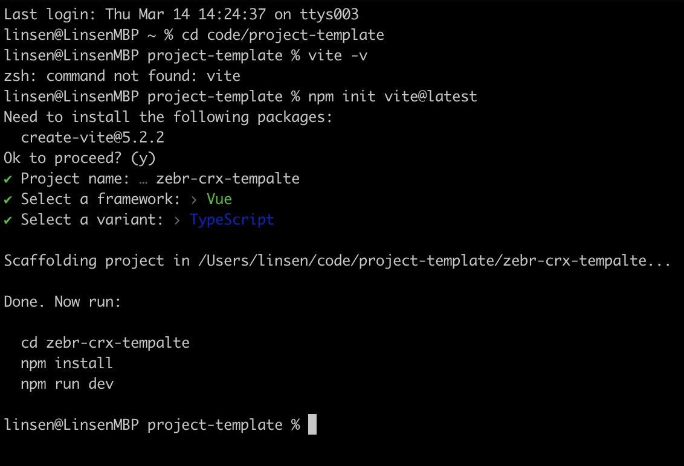
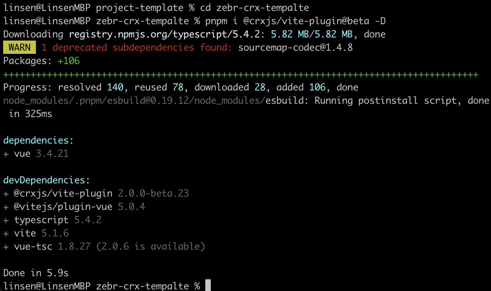
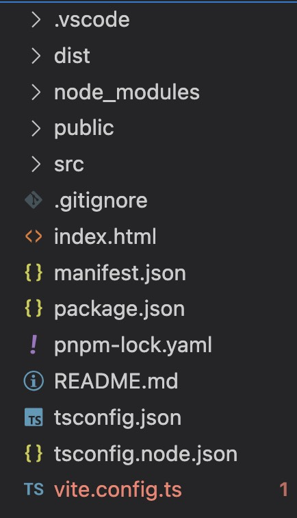
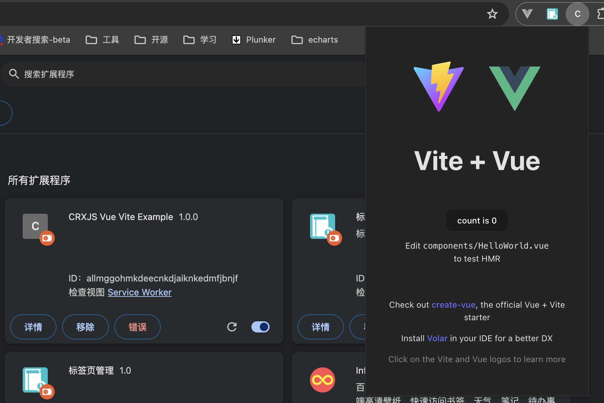
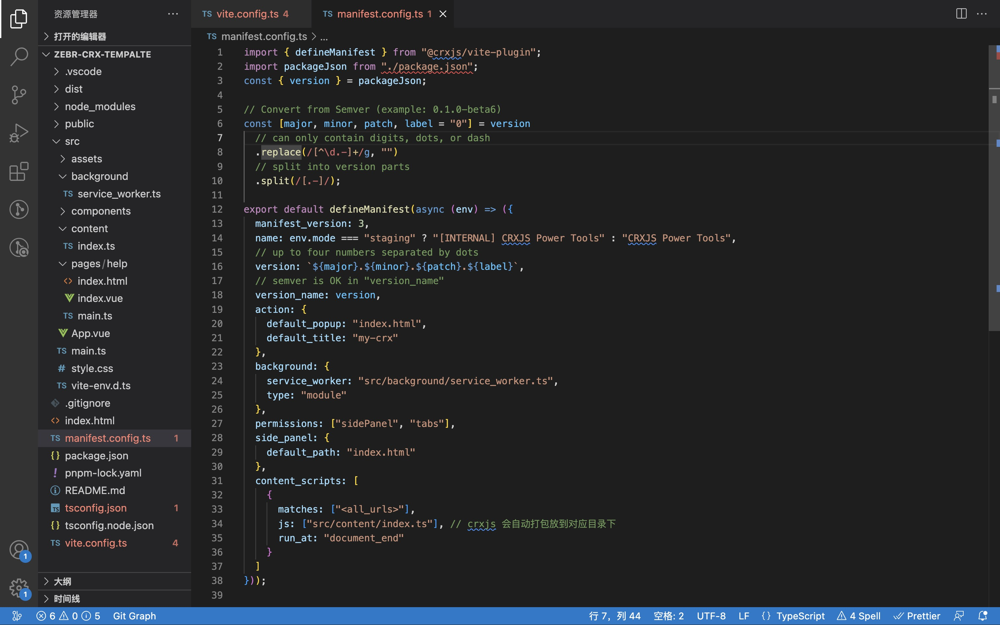
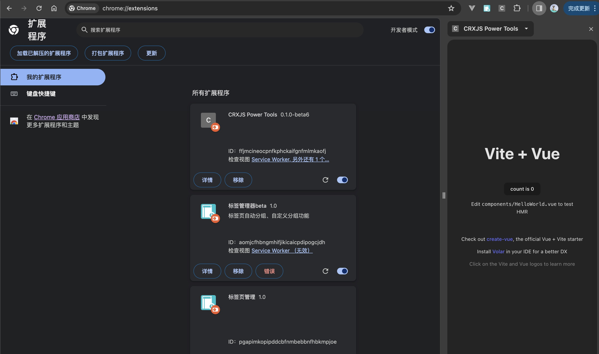

# 谷歌浏览器插件开发（Chrome extension）

## 前言

开发浏览器插件可以帮助我们提升工作效率，事半功倍效果，它拥有 web 页面不具有的 API 和 限制，它能够：

- **设计 ui 界面**
- **控制浏览器**
- **控制网络**

Ex：**跨域问题**、**监听网络请求**、**与页面通信**、**操作页面 DOM** 等；以及它拥有浏览器 API，这代表可以操作浏览器的一些行为和功能，例如：操作**标签页**、**书签**等...

[了解扩展程序的功能](https://developer.chrome.com/docs/extensions/develop?hl=zh-cn)

## 文件结构

插件的的几个基础文件

- `manifest.json`: 插件的配置信息，包括插件的基本信息、配置开启的功能、权限等...
- `index.html`: UI 界面
- `background.js`: 长期运行在插件后台的 js 代码文件
- `content-script.js`: 注入到页面的 js 脚本

除了 manifest.json 配置文件为必备的，只有 manifest.json 文件就能安装，根据开发功能需要用到的哪个文件，去添加、配置即可。
其他三个它们都能可以访问 chrome extension API，也可以互相通信。

## CRXJS

以往开发过程中修改代码时，总是需要重新编译打包，再到管理扩展程序页面点击刷新，这点体验并不是很好，如今有了 CRXJS，它 是一款 vite、rollup 插件，它支 HMR 持热更新，它主要所做的事就是省略 reload 这一步骤，使我们拥有更好的开发体验。

官方文档有以下框架的入门指南

- react
- solid
- vanilla JavaScript
- vue

[What is CRXJS?](https://crxjs.dev/vite-plugin/)

## 使用 vite 创建项目

```bash
pnpm init vite@latest
```

这里以创建 vue3 + Ts 项目为例



## 安装 crxjs 插件

```bash
pnpm i @crxjs/vite-plugin@beta -D
```



## 修改 vite.config.ts

```js
import { defineConfig } from "vite";
import vue from "@vitejs/plugin-vue";
import { crx } from "@crxjs/vite-plugin"; // [!code ++]
import manifest from "./manifest.json"; // Node 14 & 16 // [!code ++]
import manifest from "./manifest.json" assert { type: "json" }; // Node >=17 // [!code ++]

// https://vitejs.dev/config/
export default defineConfig({
  plugins: [
    vue(),
    crx({ manifest }) // [!code ++]
  ]
});
```

## 添加 manifest.json 文件，比较简单

```json
{
  "manifest_version": 3,
  "name": "CRXJS Vue Vite Example",
  "version": "1.0.0",
  "action": { "default_popup": "index.html" }
}
```

## 建议使用 manifest.config.ts 比较灵活

支持导入、获取环境变量 env

::: code-group

```ts [manifest.config.ts]
import { defineManifest } from "@crxjs/vite-plugin";
import packageJson from "./package.json";
const { version } = packageJson;

// Convert from Semver (example: 0.1.0-beta6)
const [major, minor, patch, label = "0"] = version
  // can only contain digits, dots, or dash
  .replace(/[^\d.-]+/g, "")
  // split into version parts
  .split(/[.-]/);

export default defineManifest(async (env) => ({
  manifest_version: 3,
  name: env.mode === "staging" ? "[INTERNAL] CRXJS Power Tools" : "CRXJS Power Tools",
  // up to four numbers separated by dots
  version: `${major}.${minor}.${patch}.${label}`,
  // semver is OK in "version_name"
  version_name: version
}));
```

```ts [vite.config.ts]
import { defineConfig } from "vite";
import vue from "@vitejs/plugin-vue";
import { crx } from "@crxjs/vite-plugin";
import manifest from "./manifest.json" assert { type: "json" }; // Node >=17 // [!code --]
import manifest from "./manifest.config"; // Node >=17 // [!code ++]

// https://vitejs.dev/config/
export default defineConfig({
  plugins: [
    vue(),
    crx({ manifest }) // [!code ++]
  ]
  // 根据启动服务的端口修改，否则 hmr 不生效
  server: {
    strictPort: true,
    port: 5173,
    hmr: {
      clientPort: 5173
    }
  }
});
```

:::

## 运行安装插件

```bash
pnpm run dev
```

生成 dist 目录



[管理扩展程序](chrome://extensions/) 加载已解压的扩展程序，添加后固定



## Popup

点击图标弹出的页面, manifest 配置

```ts
{
  // ...
  action: {
    default_popup: "index.html", // popup
    default_title: "my-crx"
  },
}
```

如何和配置多页面

1. 创建多一个 html 文件当入口

2. 修改 vite.congfig.ts 配置

```ts
// ...
import { resolve } from "path"; // [!code ++]

// https://vitejs.dev/config/
export default defineConfig({
  build: {
    rollupOptions: {
      // 多页面打包配置（像vue项目其实可以不用，直接使用vue-router实现页面跳转也行）
      input: {
        popup: resolve(__dirname, "index.html"), // [!code ++]
        help: resolve(__dirname, "./src/pages/help/index.html") // [!code ++]
      },
      output: {
        dir: "dist",
        format: "es"
      }
    }
  }
});
```

进入插件的页面： chrome-extension://`crxId`/index.html#/home

## Background

在插件后台一直运行的 js 代码文件，可以调用谷歌浏览器 API

在调用 chrome API 时没有提示，安装使用 @types/chrome

```bash
pnpm i @types/chrome
```

manifest 配置

```ts
{
  // ...
  action: {
    default_popup: "index.html", // popup
    default_title: "my-crx"
  },
  background: {// [!code ++]
    service_worker: "src/background/service_worker.ts", // 指定文件 // [!code ++]
    type: "module" // esm解析文件 // [!code ++]
  },// [!code ++]
  permissions: ["sidePanel", "tabs"], // 开启权限 // [!code ++]
  side_panel: { // [!code ++]
    default_path: "index.html" // sidePanel 显示的页面 // [!code ++]
  } // [!code ++]
}
```

创建文件 service_worker.ts， 开启点击 icon 打开 side Panel 功能，此行为会覆盖 popup 弹窗

[利用新的 Side Panel API 设计卓越的用户体验](https://developer.chrome.com/blog/extension-side-panel-launch?hl=zh-cn)

```ts
// service_worker.ts
chrome.sidePanel.setPanelBehavior({ openPanelOnActionClick: true }).catch((err) => {
  console.log(err);
});
```

## Content Scripts

页面注入脚本，可以通过请求方式访问插件内的文件，也能调用谷歌浏览器 API

manifest 配置

```ts
{
  //...
  content_scripts: [
    {
      matches: ["<all_urls>"],
      js: ["src/content/index.ts"], // crxjs 会自动打包放到对应目录下
      run_at: "document_end"
    }
  ];
}
```

## 最后

主要配置文件

::: code-group

```ts [manifest.config.ts]
import { defineManifest } from "@crxjs/vite-plugin";
import packageJson from "./package.json";
const { version } = packageJson;

// Convert from Semver (example: 0.1.0-beta6)
const [major, minor, patch, label = "0"] = version
  // can only contain digits, dots, or dash
  .replace(/[^\d.-]+/g, "")
  // split into version parts
  .split(/[.-]/);

export default defineManifest(async (env) => ({
  manifest_version: 3,
  name: env.mode === "staging" ? "[INTERNAL] CRXJS Power Tools" : "CRXJS Power Tools",
  // up to four numbers separated by dots
  version: `${major}.${minor}.${patch}.${label}`,
  // semver is OK in "version_name"
  version_name: version,
  action: {
    default_popup: "index.html",
    default_title: "my-crx"
  },
  background: {
    service_worker: "src/background/service_worker.ts",
    type: "module"
  },
  permissions: ["sidePanel", "tabs"],
  side_panel: {
    default_path: "index.html"
  },
  content_scripts: [
    {
      matches: ["<all_urls>"],
      js: ["src/content/index.ts"], // crxjs 会自动打包放到对应目录下
      run_at: "document_end"
    }
  ]
}));
```

```ts [vite.config.ts]
import { defineConfig } from "vite";
import vue from "@vitejs/plugin-vue";
import { crx } from "@crxjs/vite-plugin";
// import manifest from './manifest.json' // Node 14 & 16
import manifest from "./manifest.config"; // Node >=17
import { resolve } from "path";

// https://vitejs.dev/config/
export default defineConfig({
  build: {
    rollupOptions: {
      // 多页面打包配置（其实可以不用，直接使用router实现页面跳转也行）
      input: {
        popup: resolve(__dirname, "index.html"),
        help: resolve(__dirname, "./src/pages/help/index.html")
      },
      output: {
        dir: "dist",
        format: "es"
      }
    }
  },
  plugins: [vue(), crx({ manifest })],
  // 根据启动服务的端口修改，否则 hmr 不生效
  server: {
    strictPort: true,
    port: 5174,
    hmr: {
      clientPort: 5174
    }
  }
});
```

:::





## 下一步继续深入学习

- [Chrome extension API 参考](https://developer.chrome.com/docs/extensions/reference/api?hl=zh-cn)

## 
PS：尝试做了一款 [谷歌浏览器扩展插件 - 标签分组管理器 beta](https://github.com/zebr57/tabs-manager-crx.git)，有兴趣可以了解一下

项目概述：基于 chrome extension API 实现的对于谷歌浏览器标签页自动分组、自定义分组功能。

应用场景：由于作为开发人员经常使用浏览器时会打开多个页面，切换页面想要打开之前页面时查找不方便，这时可以借助谷歌浏览器自带标签页分组功能，这需要手动一个一个去操作，比较繁琐，因此借助谷歌浏览器插件扩展 API，实现自动化、定制化分组管理，非常快捷方便。

实现以下功能：

- 快捷操作：一键生成、取消分组、勾选指定标签页生成分组
- 当前标签：将当前窗口打开的所有标签以树节点展示，可进行修改分组标题、颜色，展开折叠、移至窗口、记录快照、关闭标签/分组功能
- 快照记录：保存分组、标签页，方便下次快速打开
- 自动匹配：输入匹配规则、新打开标签匹配自动分组
