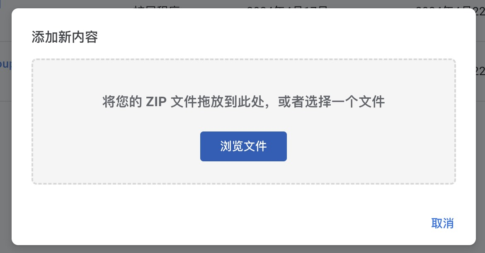
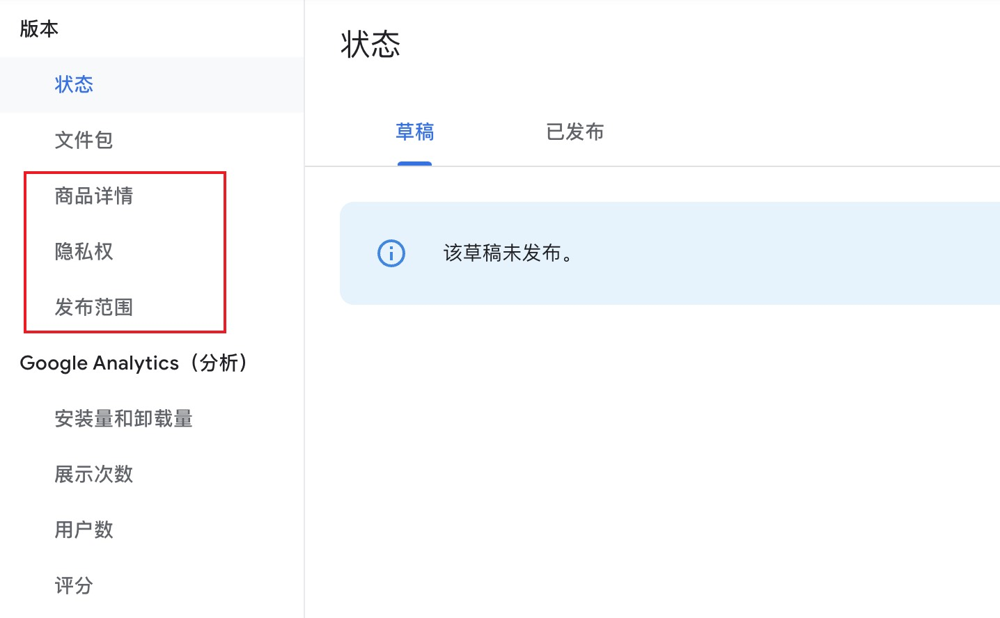
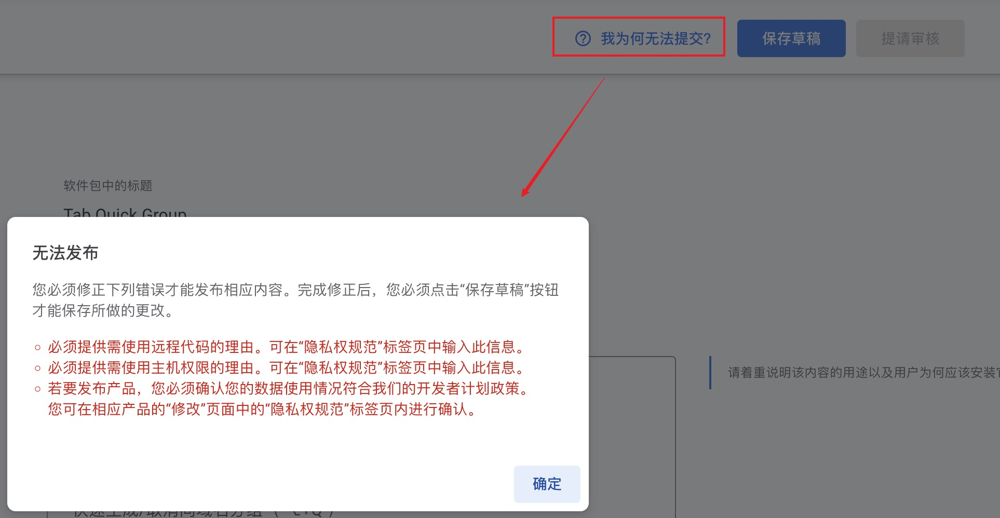
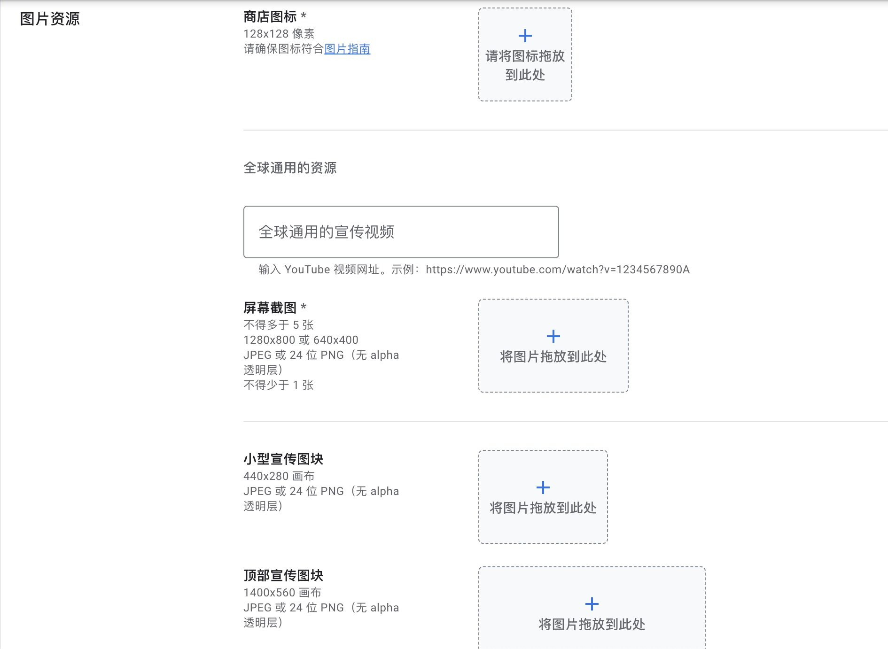
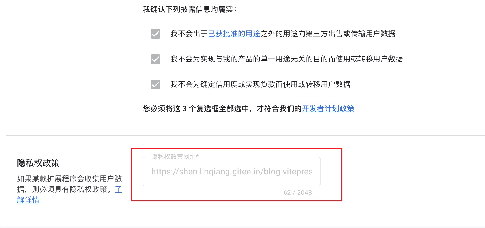
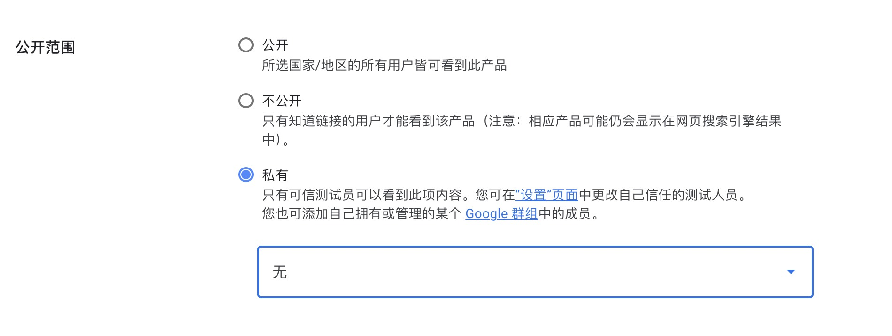

# chrome 扩展发布

## 前言

近期想将之前开发了的两款扩展发布到 chrome 应用商城，经历过后，总结了一些前期准备和需要注意的点。

## 前期准备

## 1.1 一个谷歌账号

[创建 Google 账号](https://www.google.com/intl/zh-CN/account/about/)

## 1.2 开通开发者资格

注册成为开发者 [chrome 应用商店](https://chromewebstore.google.com/)， 右上角 ... 图标

需要 5$ 注册费，并且需要 信用卡、visa 卡支付，没有可选择万能的淘宝

## 1.3 账号需要设置双重验证

[账号安全-设置二次验证](https://myaccount.google.com/)

## 开始发布

## 2.1 上传扩展 zip 压缩文件

进入 [开发者中心](https://chrome.google.com/webstore/devconsole)

点击上传新内容按钮，显示弹窗：

## 2.2 补充扩展内容信息

我们需要把以下框选部分必要的信息填上，保存为草稿，旁边没有提示需要修改，即可提交审核，注意：google 的审核时间会比较久，7 天内 or 30 天内

为何无法提交？

## 2.2 补充宣传视频或图片

需要注意你的图片尺寸是否符合要求

[在线修改图片网站](https://www.iloveimg.com/zh-cn)

## 2.3 隐私说明

需要准备一个线上的隐私说明网页

[软件隐私声明](https://shen-linqiang.gitee.io/blog-vitepress/crx-privacy.html)

## 2.4 发布范围

公开、私密、内部

发布内部只需到账号设置里，添加可信用测试人员的邮箱即可
[账号设置](https://chrome.google.com/webstore/devconsole/)

## 提交审核 Q&A

Q: 如何发布？ 
A: 提交审核时可选择自动发布 or 到[开发者中心](https://chrome.google.com/webstore/devconsole)，选择扩展发布

Q: 如果被拒绝了怎么办？ 
A: 点击扩展-状态-查看原因，修改后保存草稿再次提交审核

Q: 如何迭代版本？ 
A: 上传新 zip，再次提交审核，没发布成功之前，chrome 引用商店还是之前版本，成功后会覆盖。
