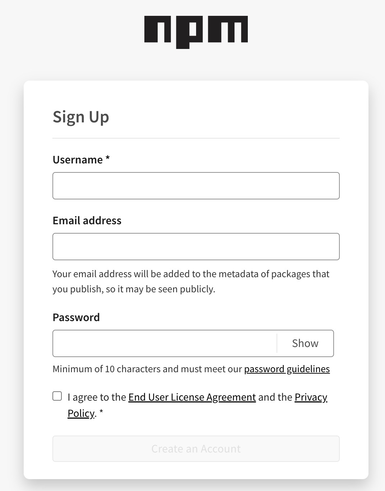
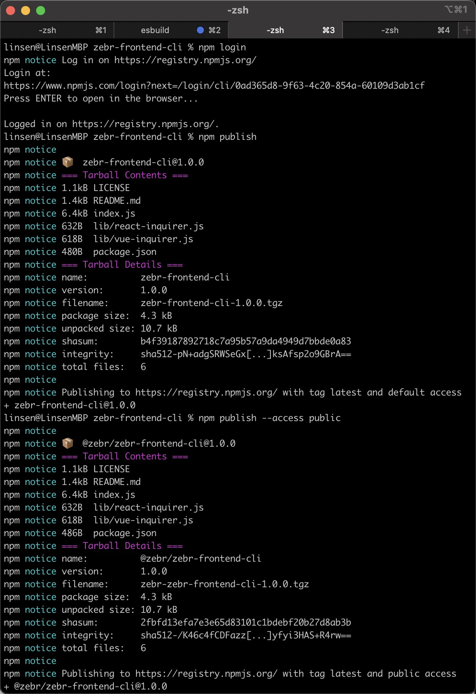
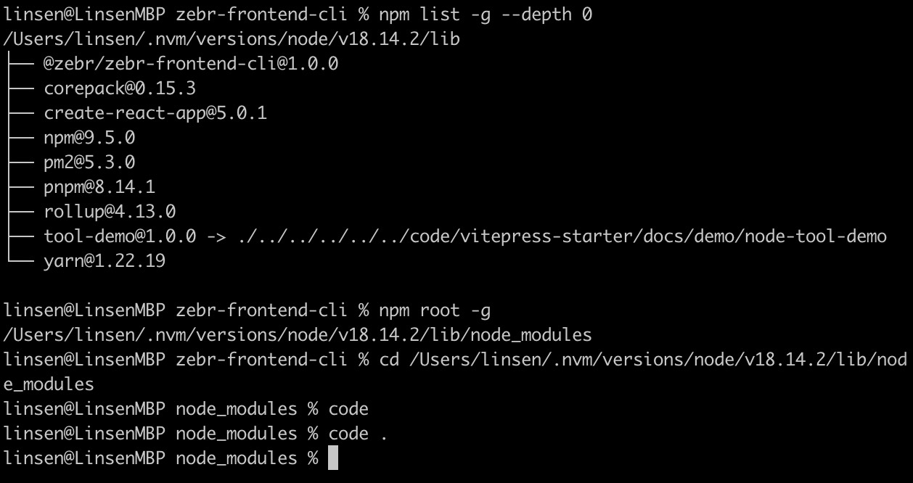

# npm 发包

## 前言导读

npm 是 **Node Package Manager** 的缩写，是 Node.js 官方提供的包管理器，使开发者更方便地分享、安装和管理代码。

当我们开发了一些功能、工具、组件模块，想要分享出来供他人使用，可以将其在 npm 上发布。好处在于不用再发送文件安装依赖等操作，只需用过命令行 `npm install xxx` 安装后引入即可使用，也有利于版本更新时方便管理。

## 注册 npm 账号

1. 前往 [npm 官网](https://www.npmjs.com/)

2. 点击右上角 sign up

3. 输入 用户名、邮箱、密码、勾选同意，跳转等待邮箱验证



:::tip
用户名一旦通过，后续不可修改
:::

## 准备项目

新建或者使用已有项目

```bash
npm init --yes
```

发包信息在于 package.json 文件

```json
{
  "name": "my-package", // 包名
  "version": "1.0.0", // 版本
  "description": "", // 描述
  "main": "index.js", // 主要文件
  "type": "module",
  "scripts": {
    "test": "echo \"Error: no test specified\" && exit 1"
  },
  "keywords": [],
  "author": "",
  "license": ""
}
```

## npm 包调试

发布之前本地调试，本地关联 npm 依赖，进入项目所在目录：

```bash
npm link
```

在其他项目中使用，npm link `<package name>`

```bash
npm link my-package
```

取消项目与 npm 包的关联

```bash
npm unlink my-package -g
```

::: tip
npm unlink 发生错误可能为没添加 -g 全局指令，[[BUG] npm unlink 重大更改是故意的吗？](https://github.com/npm/cli/issues/1946)
:::

## 登录 npm

1. npm 的官方源

```bash
npm config set registry https://registry.npmjs.org/
```

:::tip
假如你是淘宝镜像源，它会让你跳转浏览器登录、注册 cnpm 账号，还有注意是 https ，不然会报错登录不了
:::

2. 检查代理，国外站点访问比较畅通

```shell
npm login
```

输入账号、密码然后前往邮箱验证，这里就登录好了，我们在项目目录下执行发包命令就能发包了

## 发个人包和组织包的区别

1. 包名

- 个人包：包名开头小写字母，支持小写字母、数字、- 符号
- 组织包：包名@开头，例如：@vue/cli

2. 组织包需要创建组织

- 点击右上角头像，选择 Add Organization +
- 输入一个未重复的名称，点击创建

3. 发包命令方式

```shell
# 个人
npm publish
# 组织/自己账号下
npm publish --access public
```



## 从 npm 安装到本地

```bash
npm i my-package
# or
npm i @xxx/my-package
```

2. 查看本地 npm 全局安装的依赖

```shell
# --depth 0 表示层级
npm list -g --depth 0
```

以我安装的为例

```js
/Users/linsen/.nvm/versions/node/v18.14.2/lib
├── @zebr/zebr-frontend-cli@1.0.0  // 在这
├── corepack@0.15.3
├── create-react-app@5.0.1
├── npm@9.5.0
├── pm2@5.3.0
├── pnpm@8.14.1
├── rollup@4.13.0
├── tool-demo@1.0.0 -> ./../../../../../code/vitepress-starter/docs/demo/node-tool-demo // 本地关联依赖为这样子
└── yarn@1.22.19
```

查看 npm 安装依赖的路径

```shell
npm root -g
# /Users/linsen/.nvm/versions/node/v18.14.2/lib/node_modules
cd /Users/linsen/.nvm/versions/node/v18.14.2/lib/node_modules
code . # 在编辑器打开
```



这样我们可以查看我们发的包或其他包的代码了
