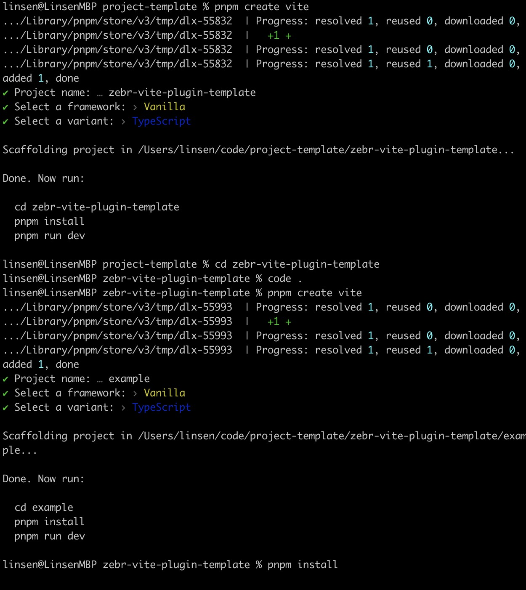
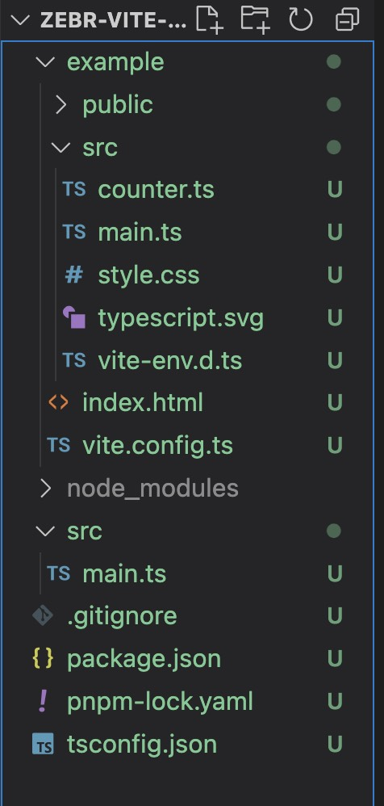
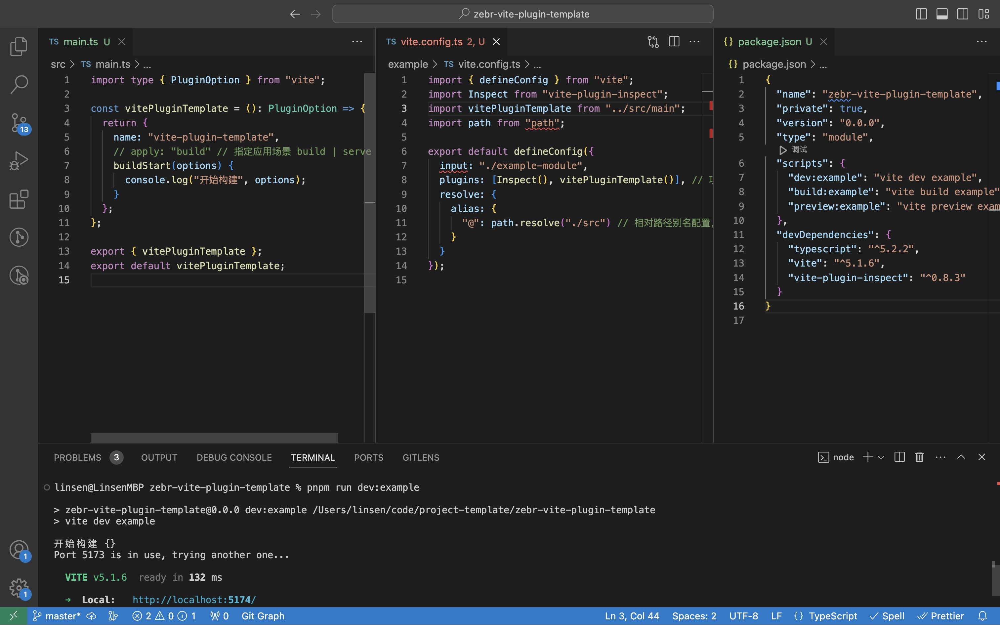

# Vite 插件开发指南

## 前言

Vite 插件是为 Vite 构建工具编写的扩展，本质是在特定的时间点（生命周期钩子）去做相对应的事，可以在构建过程中修改默认行为、添加新功能或执行自定义操作。例如：

- 自定义开发服务器
- 左右构建过程
- 代码转化
- 特殊文件类型处理
- 优化输出结果
- ...

基于 vite 是基于 Rollup 实现的，它可以兼容一些 Rollup 插件，也可以使用 Rollup 通用的钩子之外，vite 自身还有特有的钩子

## 开发须知

- 插件命名约定，请查阅 [Vite 插件 API](https://cn.vitejs.dev/guide/api-plugin.html)

## 使用 vite 创建项目

先创建

```bash
pnpm create vite
```

进入目录，在创建例子

```bash
cd projectName
pnpm create vite
```



## 整理目录

分为插件源码、和例子源码
依赖相同可以共用一个 package.json 文件和共享项目配置（ts|eslint|gitignore）



## 添加、修改文件内容并执行

- 安装 `pnpm i vite-plugin-inspect -D`
- 修改 main.ts 内容，创建插件实例
- 给 example 添加 vite.config.ts 文件，并导入 main.ts 创建的插件并使用
- 修改 package.json scripts 命令



<details>

::: code-group

```ts [src/main.ts]
import type { PluginOption } from "vite";

const vitePluginTemplate = (): PluginOption => {
  return {
    name: "vite-plugin-template",
    // apply: "build" // 指定应用场景 build | serve
    buildStart(options) {
      console.log("开始构建", options);
    }
  };
};

export { vitePluginTemplate };
export default vitePluginTemplate;
```

```ts [example/vite.config.ts]
import { defineConfig } from "vite";
import Inspect from "vite-plugin-inspect";
import vitePluginTemplate from "../src/main";
import path from "path";

export default defineConfig({
  input: "./example-module",
  plugins: [Inspect(), vitePluginTemplate()], // 项目中引入我们开发的插件
  resolve: {
    alias: {
      "@": path.resolve("./src") // 相对路径别名配置，使用 @ 代替 src
    }
  }
});
```

```json [package.json]
{
  "name": "zebr-vite-plugin-template",
  "private": true,
  "version": "0.0.0",
  "type": "module",
  "scripts": {
    "dev:example": "vite dev example",
    "build:example": "vite build example",
    "preview:example": "vite preview example"
  },
  "devDependencies": {
    "typescript": "^5.2.2",
    "vite": "^5.1.6",
    "vite-plugin-inspect": "^0.8.3"
  }
}
```

:::

<summary>点击查看代码</summary>

</details>

::: tip 不想用 vite 创建也可以手动搭建

可以单独创建一个目录 xxx

初始化 package.json `pnpm init `

安装依赖 `pnpm i vite typescript`

创建 index.js 或 index.ts 文件来写插件代码

只要在 vite 项目中的 vite.config 就能导入使用

创建例子目录 xxx/example，方便测试

xxx/example/index.html 中引入 xxx/example/src/index.js

xxx/example/vite.config.ts 导入 xxx/index.js 使用
:::

## Rollup 通用钩子 🪝

1. `options` 在服务器启动时被调用
2. `buildStart`在服务器启动时被调用
3. `resolveId`在每个传入模块请求时被调用
4. `load`在每个传入模块请求时被调用
5. `transform`在每个传入模块请求时被调用
6. `buildEnd`在服务器关闭时被调用
7. `closeBundle`在服务器关闭时被调用
8. `moduleParsed`在开发中是 不会 被调用的，因为 Vite 为了性能会避免完整的 AST 解析。
<details>

```ts
const vitePluginTemplate = () => {
  return {
    name: "vite-plugin-template",
    // rollup 通用钩子
    options() {
      console.log("1.options: 在服务器启动时被调用");
    },
    buildStart() {
      console.log("2.buildStart: 在服务器启动时被调用");
    },
    resolveId() {
      console.log("3.resolveId: 在每个传入模块请求时被调用");
    },
    load() {
      console.log("4.load: 在每个传入模块请求时被调用");
    },
    transform() {
      console.log("5.transform: 在每个传入模块请求时被调用");
    },
    buildEnd() {
      console.log("6.buildEnd: 在服务器关闭时被调用");
    },
    closeBundle() {
      console.log("7.closeBundle: 在服务器关闭时被调用");
    },
    moduleParsed() {
      console.log(
        "8.moduleParsed: 在开发中是 不会 被调用的，因为 Vite 为了性能会避免完整的 AST 解析。"
      );
    }
  };
};
export { vitePluginTemplate };
export default vitePluginTemplate;
```

<summary>点击查看代码</summary>
</details>

## vite 独有的钩子 🪝

### config

`(config: UserConfig, env: { mode: string, command: string, ssrBuild: boolean }) => UserConfig | null | void`

| 参数   | 类型                                                   | 描述                  |
| ------ | ------------------------------------------------------ | --------------------- |
| config | `UserConfig `                                          | 用户 vite.config 配置 |
| env    | `{ mode: string, command: string, ssrBuild: boolean }` | 运行环境变量          |

解析 vite 配置前调用，常用于根据环境修改 vite 配置，有两种修改方法：

- 赋值一个匿名函数，返回对象进行合并
- 直接修改 config 参数，并返回 config

```js
// 返回部分配置（推荐）
const partialConfigPlugin = () => ({
  name: "return-partial",
  config: () => ({
    resolve: {
      alias: {
        foo: "bar"
      }
    }
  })
});

// 直接改变配置（应仅在合并不起作用时使用）
const mutateConfigPlugin = () => ({
  name: "mutate-config",
  config(config, { command }) {
    if (command === "build") {
      config.root = "foo";
    }
  }
});
```

### configResolved

`(config: ResolvedConfig) => void | Promise<void>`

| 参数   | 类型              | 描述           |
| ------ | ----------------- | -------------- |
| config | `ResolvedConfig ` | 最终 vite 配置 |

解析完 vite 配置时调用，常用于获取、存储最终的配置，后续其他钩子根据配置进行操作时，他很有用。

```js
const examplePlugin = () => {
  let config; // 1.创建存储变量

  return {
    name: "read-config",

    configResolved(resolvedConfig) {
      // 2.存储最终解析的配置
      config = resolvedConfig;
    },

    // 3.在其他钩子中使用存储的配置
    transform(code, id) {
      if (config.command === "serve") {
        // dev: 由开发服务器调用的插件
      } else {
        // build: 由 Rollup 调用的插件
      }
    }
  };
};
```

### configureServer

`(server: ViteDevServer) => (() => void) | void | Promise<(() => void) | void>`

| 参数   | 类型             | 描述           |
| ------ | ---------------- | -------------- |
| server | `ViteDevServer ` | 开发服务器实例 |

是用于配置开发服务器的钩子。最常见的用例是在内部 connect 应用程序中添加自定义中间件:

此外请看：[ViteDevServer](https://cn.vitejs.dev/guide/api-javascript.html#vitedevserver)

```js
const myPlugin = () => {
  let _serve = null;

  return {
    name: "configure-server",
    configureServer(server) {
      // 在某些情况下，其他插件钩子可能需要访问开发服务器实例（例如访问 websocket 服务器、文件系统监视程序或模块图）。这个钩子也可以用来存储服务器实例以供其他钩子访问:
      console.log("configureServer: 是用于配置开发服务器的钩子");
      _serve = server;
      return () => {
        server.middlewares.use((req, res, next) => {
          // 自定义请求处理...
          const startTime = Date.now();
          res.on("finish", () => {
            const endTime = Date.now();
            const duration = endTime - startTime;
            console.log(`Request ${req.url} took ${duration}ms to process.`); // Request /index.html took 12ms to process.
          });
          next();
        });
      };
    },
    transform(code, id) {
      if (_serve) {
        // 使用 _serve...
      }
    }
  };
};
```

::: tip
插入中间件在其他中间件安装前调用，如果想要在其他中间件安装后调用，请返回一个函数。

注意 `configureServer` 在运行生产版本时不会被调用，所以其他钩子需要防范它缺失。
:::

### configurePreviewServer

`(server: PreviewServer) => (() => void) | void | Promise<(() => void) | void>`

| 参数   | 类型             | 描述           |
| ------ | ---------------- | -------------- |
| server | `ViteDevServer ` | 预览服务器实例 |

与 configureServer 相同，但用于预览服务器。也是最前面调用，最后调用也是返回一个函数封装调用。

此外参见：[PreviewServerForHook](https://cn.vitejs.dev/guide/api-javascript.html#previewserverforhook)

```js
const myPlugin = () => ({
  name: "configure-server",
  configureServer(server) {
    // 返回一个在内部中间件安装后
    // 被调用的后置钩子
    return () => {
      server.middlewares.use((req, res, next) => {
        // 自定义请求处理...
      });
    };
  }
});
```

### transformIndexHtml

专门处理 `index.html` 的钩子，常用于 获取 html 文件、修改 html 内容，标题、icon 等...

```js
const htmlPlugin = () => {
  return {
    name: "html-transform",
    transformIndexHtml(html) {
      return html.replace(/<title>(.*?)<\/title>/, `<title>Title replaced!</title>`);
    }
  };
};
```

### handleHotUpdate

hmr 热更新时调用，可以查看更新的文件和影响对应的模块

::: code-group

```js [my-plugin.ts]
handleHotUpdate({ server }) {
  console.log("handleHotUpdate: 执行自定义 HMR 更新处理， 更新文件为：", payload.file);
  // payload.file =>  /Users/linsen/code/vite-plugin-template/example/src/index.ts

  // 如果需要与客户端通信，也可使用 `server.ws.send` 来支持 Vite <5.1 版本>
  server.ws.send({
    type: 'custom',
    event: 'special-update',
    data: {}
  })
  return []
}
```

```js [example/src/index.ts]
console.log("update code 2"); // 修改保存触发更新

// 与开发服务器通信
if (import.meta.hot) {
  import.meta.hot.on("special-update", (data) => {
    // 执行自定义更新
    console.log(data, "special-update");
  });
  import.meta.hot.on("my:ack", (data) => {
    console.log(data.msg); // hello
  });
  import.meta.hot.send("my:from-client", { msg: "Hey!" });
}
```

:::
