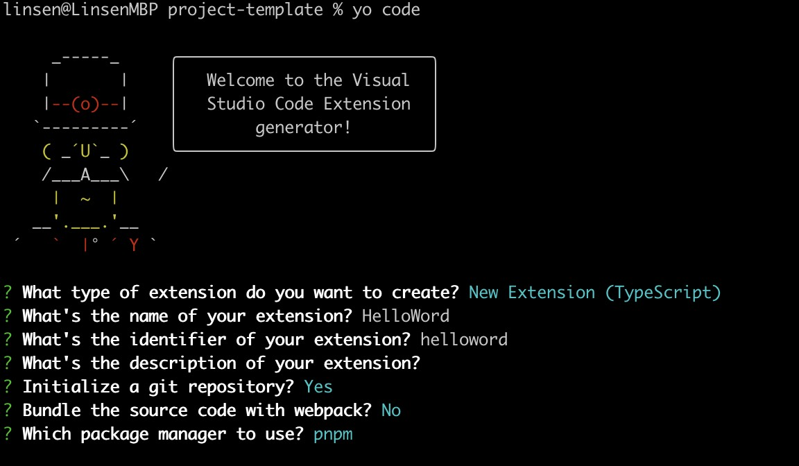
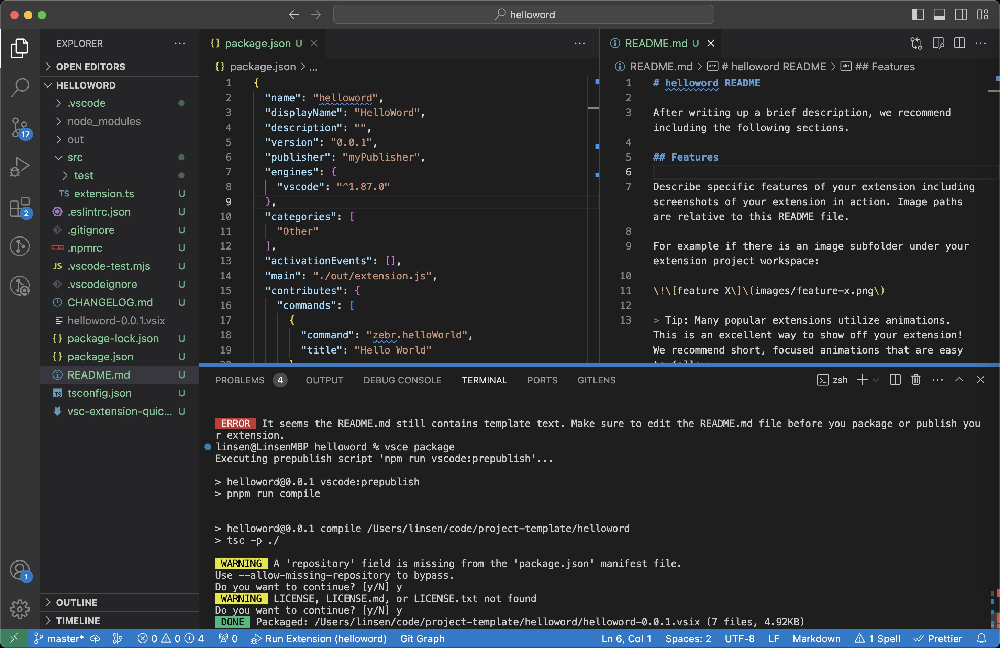
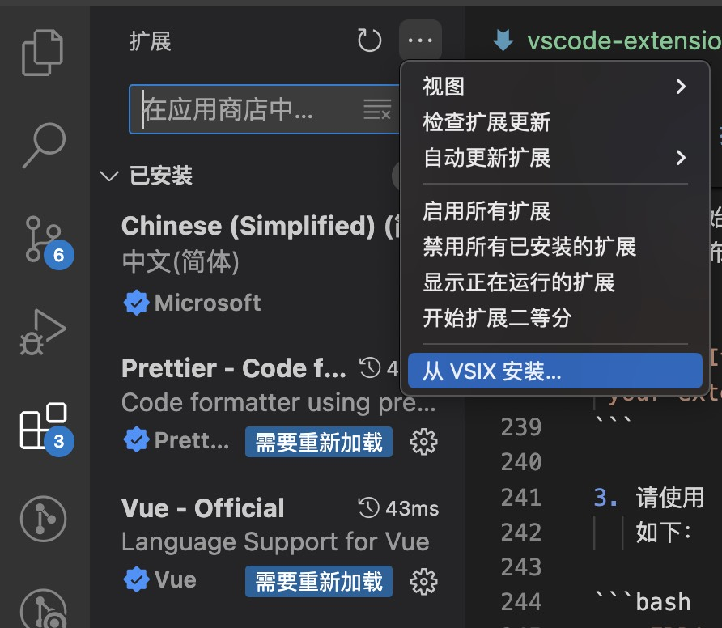

# vscode 插件开发指南

## 前言

Vscode 作为前端开发常用的开发工具，它有丰富的插件市场，扩展性很高，即使这样，我们在日常使用中，可能会觉得某些操作要是能在 vscode 内完成就好了，比如说 Vue 项目中使用 ElementUI 的 el-tale 组件，选中代码结构生成 mock 数据，但这只是一个小需求，应用范围窄，不太可能有作者专门去开发一个插件，像这开发中常见的操作，可以利用插件去做，完了发包霍霍同事...

## 扩展可以做什么？

以下是使用扩展 API 可以实现的一些示例：

- 使用颜色或文件图标主题更改 Vscode 的`外观` -主题
- 在 UI 中添加自定义`组件`和`视图` -扩展工作台
- 创建 `Webview` 以显示使用 HTML/CSS/JS 构建的`自定义网页` - Webview 指南
- 支持`新的编程`语言 -语言扩展概述
- 支持调试`特定运行`时 -调试器扩展指南

[扩展功能概述](https://code.visualstudio.com/api/extension-capabilities/overview) 

## 起步

确保已安装 Node.js 和 Git。

## 创建项目

首先，我们需要使用 Yeoman 和 VS Code Extension Generator 构建一个可供开发的 TypeScript 或 JavaScript 项目。

如果您不想安装 Yeoman 供以后使用，请运行以下命令：

```bash
npx --package yo --package generator-code -- yo code
```

如果您想全局安装 Yeoman 以方便重复运行，请运行以下命令：

```bash
npm install --global yo generator-code

yo code
```

::: tip
**选择 npm 或 yarn 作为包管理工具，pnpm 无法打包，后面会说明**
:::

如果是 TypeScripts 项目，如下选择：



创建好打开项目，在 src/extension.ts 下 按 F5 运行调试

会弹出一个新的 vscode 界面，选择打开文件后，在这个界面`⌘⇧+p`打开输入指令 helloword，会出现一条消息

[视频演示](https://code.visualstudio.com/api/get-started/your-first-extension/launch.mp4)

## 目录结构

```bash
├── node_modules
├── out
│   ├── test
│   ├── extension.js
│   └── extension.js.map
├── src
│   ├── test
│   └── extension.ts // 扩展功能逻辑实现
├── CHANGELOG.md
├── README.md
├── package.json  // 配置扩展功能
├── pnpm-lock.yaml
├── tsconfig.json
└── vsc-extension-quickstart.md
```

## package.json 配置扩展功能

package.json 中 `contributes`字段是您的扩展程序注册贡献点以扩展 Visual Studio Code 中的各种功能。比如改示例使用到的 `contributes.commands`，就是我们按`⌘⇧+p` 打开输入匹配的指令行为，`contributes.menus` 是我们鼠标右键显示的菜单栏，他可以指定匹配区域（当我们在不同区域右键时出现的菜单），例如左侧目录区域、编辑区域、tab 文件标题等...

```json [package.json]
{
  "name": "helloword",
  "displayName": "HelloWord",
  "description": "",
  "version": "0.0.1",
  "engines": {
    "vscode": "^1.87.0" // tip：最低版本号
  },
  "categories": ["Other"],
  "activationEvents": [],
  "main": "./out/extension.js",
  "contributes": {
    // 注册指令
    "commands": [
      {
        "command": "HelloWord.helloWorld", // 定义指令 《插件名.指令》
        "title": "Hello World"
      }
    ],
    // 注册右键菜单选项
    "menus": {
      "editor/context": [
        {
          "command": "HelloWord.helloWorld", // 执行对应指令
          "when": "editorHasSelection", // 选中内容时
          "group": "1_modification" // 编辑器中选项出现位置：navigation | 1_modification | 9_cutcopypaste | z_commands
        }
      ]
    }
  },
  "scripts": {
    "vscode:prepublish": "pnpm run compile",
    "compile": "tsc -p ./",
    "watch": "tsc -watch -p ./",
    "pretest": "pnpm run compile && pnpm run lint",
    "lint": "eslint src --ext ts",
    "test": "vscode-test"
  },
  "devDependencies": {
    "@types/vscode": "^1.87.0", // 最低版本号
    "@types/mocha": "^10.0.6",
    "@types/node": "18.x",
    "@typescript-eslint/eslint-plugin": "^7.0.2",
    "@typescript-eslint/parser": "^7.0.2",
    "eslint": "^8.56.0",
    "typescript": "^5.3.3",
    "@vscode/test-cli": "^0.0.6",
    "@vscode/test-electron": "^2.3.9"
  }
}
```

## extension.ts 扩展功能逻辑实现

尝试使用以下 Vscode API

- 自定义命令
- 获取选中内容
- 编辑器插入内容
- 自定添加右键菜单选项

```ts [extension.ts]
// vscode API
import * as vscode from "vscode";

// 启动vscode时
export function activate(context: vscode.ExtensionContext) {
  console.log('Congratulations, your extension "HelloWord" is now active!');
  // 注册指令
  let disposable = vscode.commands.registerCommand("HelloWord.helloWorld", () => {
    // 获取当前文件编辑器
    const editor = vscode.window.activeTextEditor;
    // 获取选中文本
    let text = editor?.document.getText(editor.selection);
    // 往编辑器插入内容
    editor?.edit((build) => {
      build.insert(editor.selection.end, "<div>来自测试插件插入的文本</div>");
    });
    // 窗口弹窗提示信息
    vscode.window.showInformationMessage("Hello World from HelloWord.HelloWord!");
  });

  context.subscriptions.push(disposable);
}

// 关闭vscode时
export function deactivate() {}
```

## 如何调试

当我们修改代码时，则需要重新运行开发窗口

- 项目主窗口 点击刷新按钮
- 调试窗口 命令 reload window
- 调试窗口 ctrl + R

调试代码

- console.log
- 断点调试

::: tip
问题：调试窗口输入 helloword 没有显示匹配指令

原因： package.json 中 `engines.vscode` 指定版本与先用 vscode 版本对不上

解决：修改 engines.vscode | 升级 vscode 版本
:::

## 打包

当我们功能都开发调试好之后，我们要将插件给他人使用时，需要打包成 visx 文件安装使用，有两种供他人获取和安装方式：

- 发送 vsix 文件本地安装
- 发布插件市场下载安装

首先我们要借助官方的工具 @vscode/vsce 来完成打包，全局安装：

```bash
npm install -g @vscode/vsce
```

运行打包命令

```bash
$ cd myExtension
$ vsce package
# 打包成vsix文件
```

运行 `vsce package` 如图下示例：

```bash
linsen@LinsenMBP helloword % vsce package
Executing prepublish script 'npm run vscode:prepublish'...

> helloword@0.0.1 vscode:prepublish
> pnpm run compile


> helloword@0.0.1 compile /Users/linsen/code/project-template/helloword
> tsc -p ./

 WARNING  A 'repository' field is missing from the 'package.json' manifest file.
Use --allow-missing-repository to bypass.
Do you want to continue? [y/N] y
 WARNING  LICENSE, LICENSE.md, or LICENSE.txt not found
Do you want to continue? [y/N] y
 DONE  Packaged: /Users/linsen/code/project-template/helloword/helloword-0.0.1.vsix (7 files, 4.92KB)
linsen@LinsenMBP helloword %
```



## 安装

- 以 vsix 文件形式，安装我们的插件：点击扩展项 - 点击右上角... - 选择 vsix 文件



- 发布到市场上，可搜索安装（需要先注册账号）

```bash
vsce publish
# 发布到插件市场
```

也可以到 [插件市场](https://marketplace.visualstudio.com/VSCode) 网站上可视化操作

## 坑！！

::: warning

1. 项目初始化 package.json 中 `engines.vscode` 版本默认最新版本，可能高于你现在用的 vscode 版本，从而导致不起作用!
2. 不能发布测试代码插件，删除 readme 第一段话即可。

```bash
 ERROR  It seems the README.md still contains template text. Make sure to edit the README.md file before you package or publish your extension.
```

3. 请使用 `npm` 或 `yarn`，不要使用 `pnpm` 包管理工具，pnpm 后续打包时运行 `vsce package`，会出现 npm Err！错误，无法打包成功!
   如下：

```bash
npm ERR! missing: benchmark@^2.1.4, required by is-number@7.0.0
npm ERR! missing: gulp-format-md@^1.0.0, required by is-number@7.0.0

npm ERR! A complete log of this run can be found in:
npm ERR!     /Users/linsen/.npm/_logs/2024-03-21T08_21_04_300Z-debug-0.log
```

原因：pnpm 存在大量包内符号链接，而 vsce 不支持，看样子官方也不打算做兼容... [详情见 issues](https://github.com/microsoft/vscode-vsce/issues/421)

解决办法：删除 pnpm.lock 文件，重新 `npm install`
:::
