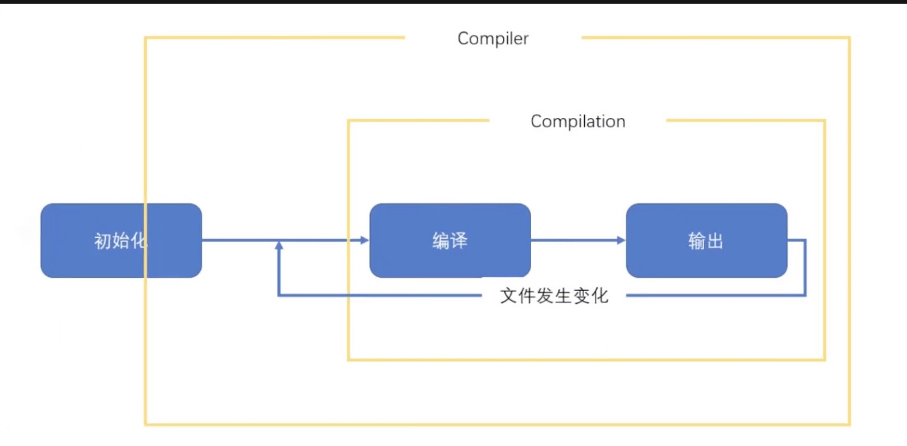
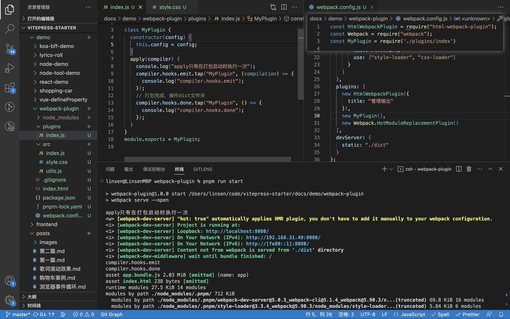

# webpack 插件开发指南

## 前言

**插件** 是 webpack 的 `支柱` 功能。Webpack 自身也是构建于你在 webpack 配置中用到的 **相同的插件系统** 之上！

插件目的在于解决 `loader` 无法实现的**其他事**。Webpack 提供很多开箱即用的 `插件`。

插件接口允许用户直接介入编译过程。 插件可以在不同时期运行的生命周期挂钩上注册回调函数。 在单个编译流程中，当每个钩子都被执行后，插件将拥有 当前编译流程的完整访问权限。

## 本质

- 插件其实就是一个 class 类，其中有一个 apply 方法，携带参数 compiler
- 主要通过监听 emit、done 这两个钩子
- compiler.hooks.emit.tap 打包完成
- compiler.hooks.done.tap 打包结束
- 主要能做的是侵入式修改打包结果

## compiler 是什么

- 构造函数初始化时，创建的一个对象
- 它作为 apply 方法的参数
- 有多个生命周期钩子事件可监听
- 贯穿整个整个生命周期（构建流程）

## compilation 是什么

- 由 compiler 创建的对象
- 负责具体的打包过程
- 它也有一些**模块级别**生命周期可监听，

## 关系图



## 简单的例子代码

```js
class MyPlugin {
  constructor(config) {
    this.config = config;
  }
  apply(compiler) {
    console.log("apply 只在打包启动时执行一次");
    // 监听webpack的某某个生命周期，周期有20+
    // emit打包完成，done打包结束，
    compiler.hooks.emit.tap("MyPlugin", (compilation) => {
      console.log(compilation.assets);
    });
    // 打包结束，操作dist文件夹，tip：开发环境没有dist文件夹
    compiler.hooks.done.tap("MyPlugin", () => {
      // 增删改其他的文件等...
    });
  }
}

module.exports = MyPlugin;
```

## 编写及使用



## 参考文档

- [webpack plugin](https://webpack.docschina.org/concepts/plugins/)
- [插件 compiler 钩子](https://webpack.docschina.org/api/compiler-hooks/)
