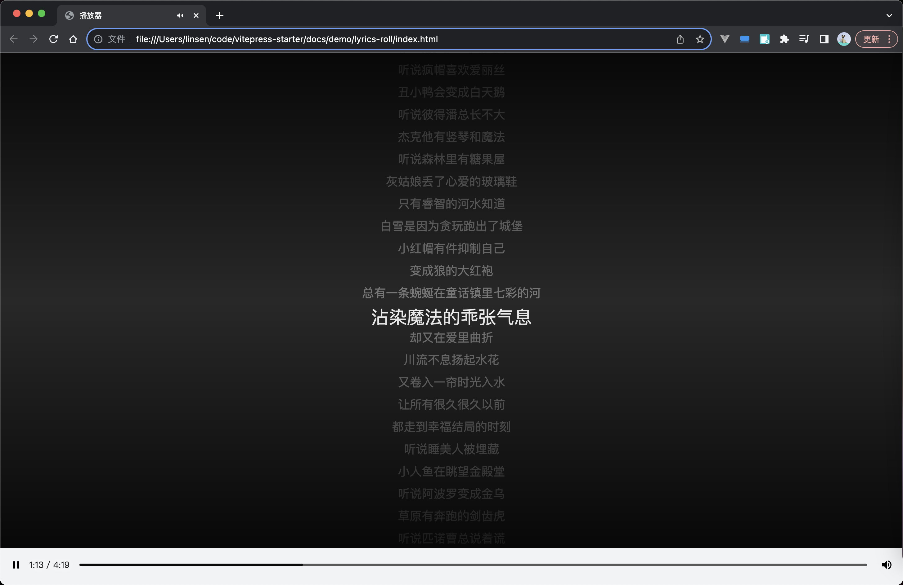

# 歌词滚动效果

## 主要功能：歌词与进度联动

- 歌词随进度滚动
- 点击歌词跳转播放
- 点击进度条歌词滚动到对应位置

## 效果



## 思路整理

1. 功能模块

- 歌词展示
  - 歌曲 mp3 文件、歌词数据（网上搜索获取）
- 播放器
  - HTML5 audio 标签

2. 实现方法

- 根据歌词文件的数据动态生成歌词

  - 将歌词数据的格式转化处理
    - ```js
      parseLrc(data); // '[00:24.50]听说白雪公主在逃跑' => {time: '00:24.50', lrc: '听说白雪公主在逃跑'}
      ```
    - ```js
      parseTime(time); //'01:24.50' => 84.50
      ```
  - 使用 li 创建歌词, 并将time转化好，用dataset保存至标签属性，之后方便获取

  - 多个元素一起创建，使用 createElementFragment，效率相对高些

- 给歌词和播放器注册监听事件
  - 点击歌词跳转高亮并滚动，并进入播放状态
  - 点击播放器进度，找出对应歌词，并滚动至对应位置

## 目录

```base
📦lyrics-roll
┣ 📜index.html
┣ 📜index.css
┣ 📜index.js
┣ 📜lrc.js
┗ 📜 童话镇.mp3
```

::: code-group

<<< @/demo/lyrics-roll/index.html
<<< @/demo/lyrics-roll/index.css
<<< @/demo/lyrics-roll/index.js
<<< @/demo/lyrics-roll/lrc.js

:::
